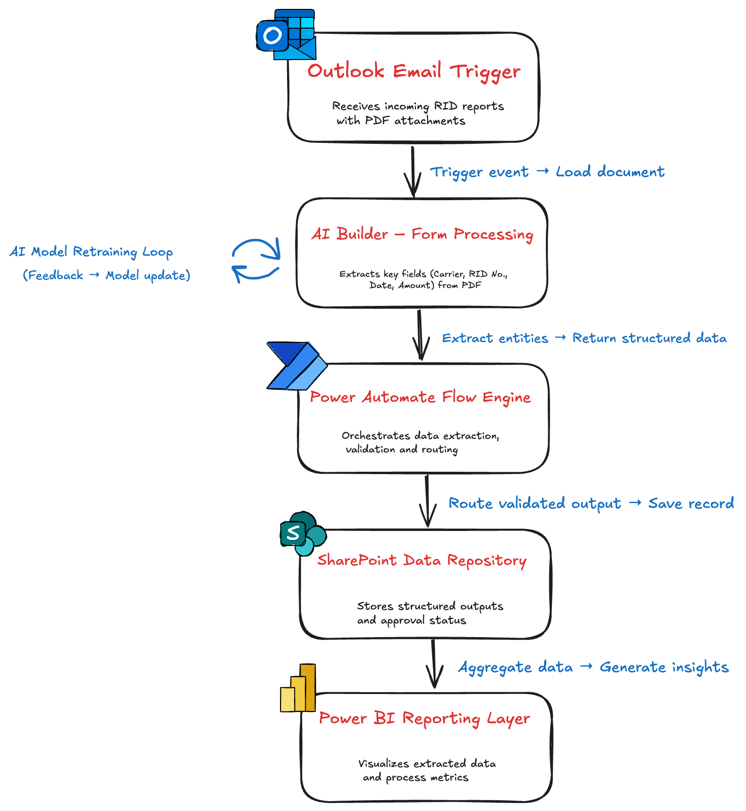

# 🧠 AI Document Automation for CD Cargo  

## 📘 Context & Motivation
Developed in 2025 as part of an applied AI automation project at **ČD Cargo**, this solution streamlines
document handling through intelligent workflows — eliminating manual extraction, validation and classification of RID reports.

---

## 🚀 Project Overview
This project demonstrates an **end-to-end AI-driven document automation pipeline** built on the **Microsoft Power Platform**.
It integrates **AI Builder**, **Power Automate**, **SharePoint**, and **Outlook** into a unified system for document processing,
validation and data storage.

---

## 💡 Key Features  
- AI Builder–based document classification and field extraction.  
- Automated routing and approval workflows built in Power Automate.  
- Centralized SharePoint data management with full audit trail.  
- Seamless Outlook integration for automatic email ingestion.  
- Adaptive feedback loops for model retraining and continuous accuracy improvement.    

---

## 🧩 System Architecture  
[Outlook Email]  
↓  
[AI Builder – Document Processing]  
↓  
[Power Automate – Workflow Engine]  
↓  
[SharePoint – Data Repository]  
↓  
[Reporting Layer (Power BI)]

  

---

## 🧠 Architecture Highlights  
- Modular and event-driven Power Automate flows  
- Separate AI Builder collections for carrier-specific layouts  
- Dynamic SharePoint integration  
- Error-handling and retraining subflows  
- Optional Power BI monitoring dashboards  

---

## 🧱 Tech Stack  
| Layer | Technology |
|-------|-------------|
| **AI & Automation** | Microsoft Power Automate, AI Builder |
| **Data** | SharePoint, Excel Connectors |
| **Integration** | Outlook Connector, OneDrive |
| **Monitoring** | Power BI |

---

## ⚙️ Workflow Overview  
1. Outlook email with a PDF attachment triggers the Power Automate flow.  
2. AI Builder extracts structured data (e.g., RID number, date, carrier, amount).  
3. Extracted fields are written to a SharePoint list.  
4. Notification is sent for review and approval.  
5. Approved data becomes part of the reporting dataset.

---

## 📊 Results & Impact  
- Manual document processing time reduced by ~85%.  
- Improved accuracy and traceability through automation.  
- Enhanced cross-department data access and reporting visibility.  
- Fully automated inbound document handling.

---

## 🔍 Future Enhancements  
- Integrate **Azure OpenAI** for semantic validation.  
- Extend AI Builder models for multilingual templates.  
- Add **Power BI** dashboard for process analytics.

---

## 🎥 Demo Video
Watch how the automation works end-to-end:  
[▶️ Watch the demo](https://youtu.be/di_E78TTW4k)

---

## 📘 Full Documentation
📄 [Bachelor Thesis – *Automatizace procesů pomocí Microsoft Power Automate*](https://hdl.handle.net/10195/85703)  
Published in the digital library of University of Pardubice, 2025.  
The thesis (written in czech) provides a detailed description of the system architecture, AI model training, and process automation design.

---

## 👩‍💻 Author  
**Lada Bilak**  
Transport Engineering graduate, focusing on AI & Data Science.  
📧 lada.bilak1@gmail.com  
🌐 [GitHub Profile](https://github.com/bilaklada)
